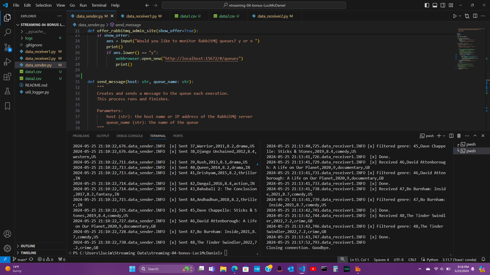

# Streaming Module4 BONUS
## Student: Luci McDaniel
### GitHub Profile: https://github.com/LuciMcD
### Date: May 25, 2024

## Before You Begin

1. Fork this starter repo into your GitHub.
2. Clone your repo down to your machine.
3. View / Command Palette - then Python: Select Interpreter
4. Select your conda environment. 

## Execute the Producer

## Execute a Consumer / Worker

 

## Ready for Work

## Start Another Listening Worker 

## Reference

- [RabbitMQ Tutorial - Work Queues](https://www.rabbitmq.com/tutorials/tutorial-two-python.html)
- [link to csv dataset] https://www.kaggle.com/datasets/thedevastator/the-ultimate-netflix-tv-shows-and-movies-dataset

## Screenshots
