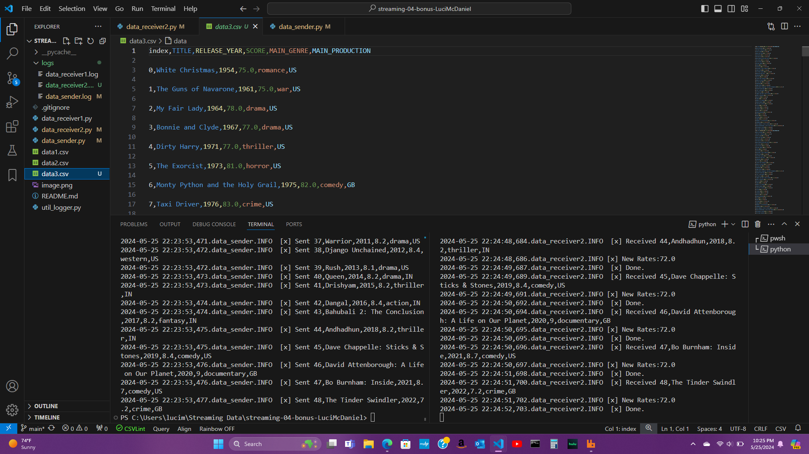

# Streaming Module4 BONUS
## Student: Luci McDaniel
### GitHub Profile: https://github.com/LuciMcD
### Date: May 25, 2024

## Overview
This repo contains a data sender script and 2 data receivers. The original dataset (data1.csv) contains data on the "best" Netflix movies. The data_sender.py sends all of the data from data1.csv. The first consumer data_receiver1.py receives the data from the sender and filters/highlights only the romance movies. Then saves that edited data to data2.csv. The second consumer data_receiver2.py received the data from the sender and converts the scores to percentages out of 100. Then saves that data to data3.csv. 

## Before You Begin

1. Fork this starter repo into your GitHub.
2. Clone your repo down to your machine.
3. View / Command Palette - then Python: Select Interpreter
4. Select your conda environment. 

## Before running data_sender.py
Make sure the queue matches on the sender and the receiver.
Also be sure to install pika on your machine to run the python scripts.

## Reference

- [RabbitMQ Tutorial - Work Queues](https://www.rabbitmq.com/tutorials/tutorial-two-python.html)
- [link to csv dataset] https://www.kaggle.com/datasets/thedevastator/the-ultimate-netflix-tv-shows-and-movies-dataset

## Screenshots
Screenshot running 2 terminals with the first consumer.

Screenshot running 2 terminals with the second consumer.

